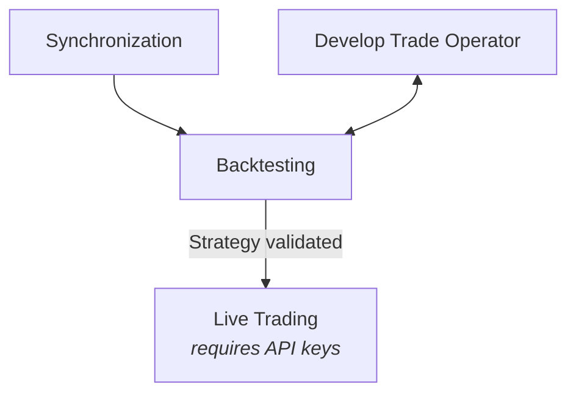

# quantoxide

A Rust framework for developing, backtesting, and deploying algorithmic trading strategies for
Bitcoin futures.

This crate is built on top of [`lnm-sdk`](https://github.com/flemosr/lnm-sdk), using the
[LN Markets](https://lnmarkets.com/) API. It provides a complete workflow from strategy development
to live trading, with local historical data testing capabilities.

> **Disclaimer**: This is alpha software provided "as is" without warranty of any kind. Understand
> that bugs may result in loss of assets. Use at your own risk.

[](https://crates.io/crates/quantoxide)
[](https://docs.rs/quantoxide/latest/quantoxide/)
[](https://github.com/flemosr/quantoxide/blob/main/LICENSE)

[Repository](https://github.com/flemosr/quantoxide) |
[Examples](https://github.com/flemosr/quantoxide/tree/main/examples) |
[Documentation](https://docs.rs/quantoxide/latest/quantoxide/) |
[AI Quickstart Prompt](https://raw.githubusercontent.com/flemosr/quantoxide/refs/heads/main/QUICKSTART_PROMPT.md)

## Getting Started

### Rust Version

This project's MSRV is `1.94`.

### Dependencies

```toml
[dependencies]
quantoxide = "<quantoxide-version>"
```

### Requirements

A local database instance is required to store historical price data. SQLite and PostgreSQL are
supported. Quick setup instructions are available in the
[examples `README`](https://github.com/flemosr/quantoxide/blob/main/examples/README.md).

### AI Quickstart

A specialized prompt is available at
[**QUICKSTART_PROMPT**](https://github.com/flemosr/quantoxide/blob/main/QUICKSTART_PROMPT.md)
([raw link](https://raw.githubusercontent.com/flemosr/quantoxide/refs/heads/main/QUICKSTART_PROMPT.md)).

This prompt guides AI agents through the complete workflow from setup to live trading, with proper
version management and API usage patterns, reducing hallucinations and improving code quality. It is
**strongly recommended** that its raw content be copied and pasted in a fresh session for optimal
results.

## Usage

`quantoxide` provides four core components for the complete algorithmic trading workflow:

### Trade Operator

The **Trade Operator** is where trading strategy logic is implemented. It runs at regular
intervals, has access to the current trading state, and can perform trading operations via the
`TradeExecutor`.

Trade operators can be implemented in two ways:
- **Raw operators** process OHLC data and execute trades within a single component. Recommended
  for straightforward, single-strategy use cases.
- **Signal-based operators** delegate OHLC processing to Signal Evaluators and handle signal
  interpretation and trade execution. Useful for separating analysis from trading logic, enabling
  strategies that incorporate multiple signals, or running multiple strategies in parallel.

### Synchronization

The **Synchronization** process is responsible for determining the current state of the local
database, identifying gaps, and fetching the necessary data from LN Markets to remediate them.
Having some continous historical market data stored in the database is a prerequisite for
backtesting. The `SyncEngine` supports both 'backfill' mode (to fetch historical OHLC candle and
funding settlement data) and 'live' mode, handling live price data received via the Stream API.

### Backtesting

The **Backtesting** engine allows trading strategies to be tested against historical price data
stored in the local database, without risking real funds. The `BacktestEngine` replays
historical market conditions, simulating the Trade Operator actions and tracking performance metrics.
Backtests include:
+ High-resolution market replay using real 1-minute OHLC data
+ Historically accurate [funding fees](https://docs.lnmarkets.com/resources/futures/#funding-fees)
  applied using synchronized settlement data, so that results realistically reflect the cost of
  holding positions across funding events
+ Simulated stoplosses (including trailing), takeprofits, and liquidations

This allows strategies to be iterated on, parameters to be adjusted, and profitability to be
estimated, all locally in a risk-free environment.

### Live Trading

Strategies can be deployed with the **Live Trading** engine. The `LiveTradeEngine` connects to
LN Markets via authenticated API calls and executes the Trade Operator actions in real-time. It
manages actual positions with real funds. Thorough testing is recommended before going live.

## Suggested Workflow



1. **Development**: Implement trading strategy as a Trade Operator
2. **Synchronization**: Fetch and store historical price data locally (required for backtesting)
3. **Backtesting**: Test strategy against historical data, analyze results
4. **Refinement**: Iterate on strategy based on backtest performance
5. **Deployment**: Once validated, deploy strategy to live trading

Synchronization relies on public endpoints of the LN Markets API, so Trade Operators can be
developed and backtested with historical data before needing to create a LN Markets account and
obtain API v3 keys. When creating API keys for live trading, they should be configured with
granular permissions following the *principle of least privilege*.

**Recommended API key permissions for live trading**:
+ `account:read` to view account balance
+ `futures:isolated:read` to view isolated margin positions
+ `futures:isolated:write` to create and manage isolated positions
+ `futures:cross:read` to view the cross margin position
+ `futures:cross:write` to manage the cross margin position

## Current Limitations

This project is in active development and currently has the following limitations:

- `TradeExecutor` uses market orders only for isolated and cross-margin trade entry/exit.
  Limit-order placement and general open-order management are not supported yet.

## Examples

Complete runnable examples are available in the
[`quantoxide/examples`](https://github.com/flemosr/quantoxide/tree/main/examples)
directory. The snippets below demonstrate the core components of the framework.

> **Note**: `println!` and other `stdout`/`stderr` outputs should be avoided when TUIs are running,
> since they would disrupt rendering. TUI `::log` methods should be used instead, as implemented in
> the complete examples.

### Trade Operator

```rust,ignore
use quantoxide::{
    error::Result,
    models::{Lookback, MinIterationInterval, OhlcCandleRow, OhlcResolution},
    trade::{RawOperator, TradeExecutor},
};

// ...

#[async_trait]
impl RawOperator for MyOperator {
    // ...
    
    fn lookback(&self) -> Option<Lookback> {
        // Use 15-minute candles with a 10-candle period
        Some(Lookback::new(OhlcResolution::FifteenMinutes, 10).expect("is valid"))
    }

    fn min_iteration_interval(&self) -> MinIterationInterval {
        MinIterationInterval::seconds(10).expect("is valid") // Run every 10 seconds
    }

    async fn iterate(&self, candles: &[OhlcCandleRow]) -> Result<()> {
        let trade_executor = self.trade_executor()?;
        let trading_state = trade_executor.trading_state().await?;
        
        // Implement trading logic here
        // Analyze candles, check trading_state, execute trades via `trade_executor`
        
        Ok(())
    }
}
```

The trade executor includes an internal FIFO rate limiter that automatically paces requests to stay
within the LNM API's rate limits when running live, so consumers don't need to handle throttling.

See the
[`operators/raw` example](https://github.com/flemosr/quantoxide/blob/main/examples/operators/raw.rs)
for a complete template. For signal-based operators, see the
[`operators/signal` example](https://github.com/flemosr/quantoxide/blob/main/examples/operators/signal/mod.rs).

### Synchronization TUI

```rust,ignore
use quantoxide::{
    Database,
    sync::{SyncConfig, SyncEngine, SyncMode},
    tui::{SyncTui, TuiConfig},
};

let sync_tui = SyncTui::launch(TuiConfig::default(), None).await?;
let db = Database::new(&db_url).await?;
let sync_engine = SyncEngine::new(SyncConfig::default(), db, SyncMode::Backfill)?;

sync_tui.couple(sync_engine)?;
sync_tui.until_stopped().await;
```

How far back to fetch price history data can be configured with
`SyncConfig::with_price_history_reach`.

**Terminal User Interface (TUI)**:

<p align="center">
  
</p>

For a complete implementation, see the
[`sync_tui` example](https://github.com/flemosr/quantoxide/blob/main/examples/sync_tui.rs).

### Backtesting TUI

```rust,ignore
use quantoxide::{
    Database,
    trade::{BacktestConfig, BacktestEngine},
    tui::{BacktestTui, TuiConfig},
};

let backtest_tui = BacktestTui::launch(TuiConfig::default(), None).await?;
let db = Database::new(&db_url).await?;
let operator = MyOperator::new();

let backtest_engine = BacktestEngine::with_raw_operator(
    BacktestConfig::default(),
    db,
    operator,
    start_time,
    start_balance,
    end_time,
).await?;

backtest_tui.couple(backtest_engine).await?;
backtest_tui.until_stopped().await;
```

**Terminal User Interface (TUI)**:

<p align="center">
  
</p>

*Note: The backtest illustrated corresponds to a simple carry-trade strategy that hedges the full
balance, adjusting collateral as needed to avoid liquidations. Negative funding fees correspond to
revenue from funding events.*

For a complete implementation with a raw operator, see the
[`backtest_raw_tui` example](https://github.com/flemosr/quantoxide/blob/main/examples/backtest_raw_tui.rs).
Or see the
[`backtest_signal_tui` example](https://github.com/flemosr/quantoxide/blob/main/examples/backtest_signal_tui.rs)
for a signal-based approach.

For direct interaction without the TUI, see the
[`backtest_direct` example](https://github.com/flemosr/quantoxide/blob/main/examples/backtest_direct.rs),
which outputs JSON metrics (PnL, Sharpe ratios, etc) suitable for programmatic or AI-assisted
optimizations. To run multiple operators in parallel with shared computational overhead, see the
[`backtest_direct_parallel` example](https://github.com/flemosr/quantoxide/blob/main/examples/backtest_direct_parallel.rs).

### Live Trading TUI

```rust,ignore
use quantoxide::{
    Database,
    trade::{LiveTradeConfig, LiveTradeEngine},
    tui::{LiveTui, TuiConfig},
};

let live_tui = LiveTui::launch(TuiConfig::default(), None).await?;
let db = Database::new(&db_url).await?;
let operator = MyOperator::new();

let live_engine = LiveTradeEngine::with_raw_operator(
    LiveTradeConfig::default(),
    db,
    key,
    secret,
    passphrase,
    operator,
)?;

live_tui.couple(live_engine).await?;
live_tui.until_stopped().await;
```

**Terminal User Interface (TUI)**:

<p align="center">
  
</p>

For a complete implementation with a raw operator, see the
[`live_raw_tui` example](https://github.com/flemosr/quantoxide/blob/main/examples/live_raw_tui.rs).
Or see the
[`live_signal_tui` example](https://github.com/flemosr/quantoxide/blob/main/examples/live_signal_tui.rs)
for a signal-based approach.

## License

This project is licensed under the
[Apache License (Version 2.0)](https://github.com/flemosr/quantoxide/blob/main/LICENSE).

## Contribution

Unless you explicitly state otherwise, any contribution intentionally submitted for inclusion by
you, shall be licensed as Apache-2.0, without any additional terms or conditions.
